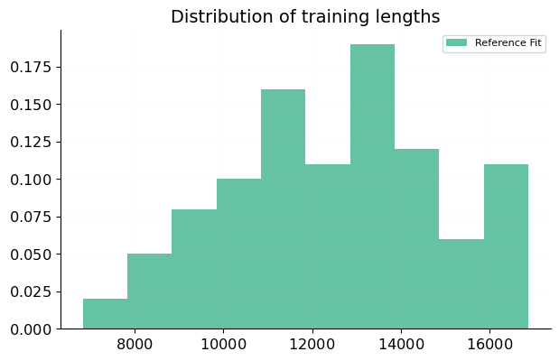

%NNPDF report comparing 240701-02-rs-nnpdf40-baseline and 240701-02-rs-nnpdf40-baseline

Summary
-------

We are comparing:

  - Current Fit (`240701-02-rs-nnpdf40-baseline`): NNPDF4.0 NNLO baseline fit (nFONLL). Comparable to NNPDF40_nnlo_as_01180_qcd
  - Reference Fit (`240701-02-rs-nnpdf40-baseline`): NNPDF4.0 NNLO baseline fit (nFONLL). Comparable to NNPDF40_nnlo_as_01180_qcd

<table class="dataframe">
<thead>
<tr style="text-align: right;">
<th></th>
<th>Current Fit</th>
<th>Reference Fit</th>
</tr>
</thead>
<tbody>
<tr>
<th>$\chi^2$</th>
<td>1.16916</td>
<td>1.16916</td>
</tr>
<tr>
<th>$<E_{\mathrm{trn}}>$</th>
<td>2.276±0.054</td>
<td>2.276±0.054</td>
</tr>
<tr>
<th>$<E_{\mathrm{val}}>$</th>
<td>2.370±0.096</td>
<td>2.370±0.096</td>
</tr>
<tr>
<th>$<TL>$</th>
<td>12500±2400</td>
<td>12500±2400</td>
</tr>
<tr>
<th>$<\chi^2>$</th>
<td>1.193±0.015</td>
<td>1.193±0.015</td>
</tr>
<tr>
<th>$\phi$</th>
<td>0.1551±0.0049</td>
<td>0.1551±0.0049</td>
</tr>
</tbody>
</table>

t0 losses
---------
<table class="dataframe">
<thead>
<tr style="text-align: right;">
<th></th>
<th>Current Fit</th>
</tr>
</thead>
<tbody>
<tr>
<th>t0pdfset</th>
<td>NNPDF40_nnlo_as_01180</td>
</tr>
<tr>
<th>$\chi^2_{t0}$</th>
<td>1.24447</td>
</tr>
<tr>
<th>$<\chi^2_{t0}>$</th>
<td>1.269±0.011</td>
</tr>
</tbody>
</table>
<table class="dataframe">
<thead>
<tr style="text-align: right;">
<th></th>
<th>Reference Fit</th>
</tr>
</thead>
<tbody>
<tr>
<th>t0pdfset</th>
<td>NNPDF40_nnlo_as_01180</td>
</tr>
<tr>
<th>$\chi^2_{t0}$</th>
<td>1.24447</td>
</tr>
<tr>
<th>$<\chi^2_{t0}>$</th>
<td>1.269±0.011</td>
</tr>
</tbody>
</table>

Theory covariance summary
-------------------------
<table class="dataframe">
<thead>
<tr style="text-align: right;">
<th></th>
<th>Current Fit</th>
<th>Reference Fit</th>
</tr>
</thead>
<tbody>
<tr>
<th>sampling</th>
<td>False</td>
<td>False</td>
</tr>
<tr>
<th>fitting</th>
<td>False</td>
<td>False</td>
</tr>
<tr>
<th>validphys statistical estimators</th>
<td>False</td>
<td>False</td>
</tr>
</tbody>
</table>

Dataset properties
------------------
<table class="dataframe">
<thead>
<tr style="text-align: right;">
<th></th>
<th>Training fraction</th>
<th>Weight</th>
<th>C-factors</th>
<th>Other fields</th>
</tr>
<tr>
<th>Dataset</th>
<th></th>
<th></th>
<th></th>
<th></th>
</tr>
</thead>
<tbody>
<tr>
<th>NMC_NC_NOTFIXED_EM-F2</th>
<td>0.75</td>
<td>1</td>
<td>-</td>
<td>custom_group: unset, variant: ('legacy_dw',)</td>
</tr>
<tr>
<th>NMC_NC_NOTFIXED_P_EM-SIGMARED</th>
<td>0.75</td>
<td>1</td>
<td>-</td>
<td>custom_group: unset, variant: ('legacy',)</td>
</tr>
<tr>
<th>SLAC_NC_NOTFIXED_P_EM-F2</th>
<td>0.75</td>
<td>1</td>
<td>-</td>
<td>custom_group: unset, variant: ('legacy_dw',)</td>
</tr>
<tr>
<th>SLAC_NC_NOTFIXED_D_EM-F2</th>
<td>0.75</td>
<td>1</td>
<td>-</td>
<td>custom_group: unset, variant: ('legacy_dw',)</td>
</tr>
<tr>
<th>BCDMS_NC_NOTFIXED_P_EM-F2</th>
<td>0.75</td>
<td>1</td>
<td>-</td>
<td>custom_group: unset, variant: ('legacy_dw',)</td>
</tr>
<tr>
<th>BCDMS_NC_NOTFIXED_D_EM-F2</th>
<td>0.75</td>
<td>1</td>
<td>-</td>
<td>custom_group: unset, variant: ('legacy_dw',)</td>
</tr>
<tr>
<th>CHORUS_CC_NOTFIXED_PB_NU-SIGMARED</th>
<td>0.75</td>
<td>1</td>
<td>-</td>
<td>custom_group: unset, variant: ('legacy_dw',)</td>
</tr>
<tr>
<th>CHORUS_CC_NOTFIXED_PB_NB-SIGMARED</th>
<td>0.75</td>
<td>1</td>
<td>-</td>
<td>custom_group: unset, variant: ('legacy_dw',)</td>
</tr>
<tr>
<th>NUTEV_CC_NOTFIXED_FE_NU-SIGMARED</th>
<td>0.75</td>
<td>1</td>
<td>MAS</td>
<td>custom_group: unset, variant: ('legacy_dw',)</td>
</tr>
<tr>
<th>NUTEV_CC_NOTFIXED_FE_NB-SIGMARED</th>
<td>0.75</td>
<td>1</td>
<td>MAS</td>
<td>custom_group: unset, variant: ('legacy_dw',)</td>
</tr>
<tr>
<th>HERA_NC_318GEV_EM-SIGMARED</th>
<td>0.75</td>
<td>1</td>
<td>-</td>
<td>custom_group: unset, variant: ('legacy',)</td>
</tr>
<tr>
<th>HERA_NC_225GEV_EP-SIGMARED</th>
<td>0.75</td>
<td>1</td>
<td>-</td>
<td>custom_group: unset, variant: ('legacy',)</td>
</tr>
<tr>
<th>HERA_NC_251GEV_EP-SIGMARED</th>
<td>0.75</td>
<td>1</td>
<td>-</td>
<td>custom_group: unset, variant: ('legacy',)</td>
</tr>
<tr>
<th>HERA_NC_300GEV_EP-SIGMARED</th>
<td>0.75</td>
<td>1</td>
<td>-</td>
<td>custom_group: unset, variant: ('legacy',)</td>
</tr>
<tr>
<th>HERA_NC_318GEV_EP-SIGMARED</th>
<td>0.75</td>
<td>1</td>
<td>-</td>
<td>custom_group: unset, variant: ('legacy',)</td>
</tr>
<tr>
<th>HERA_CC_318GEV_EM-SIGMARED</th>
<td>0.75</td>
<td>1</td>
<td>-</td>
<td>custom_group: unset, variant: ('legacy',)</td>
</tr>
<tr>
<th>HERA_CC_318GEV_EP-SIGMARED</th>
<td>0.75</td>
<td>1</td>
<td>-</td>
<td>custom_group: unset, variant: ('legacy',)</td>
</tr>
<tr>
<th>HERA_NC_318GEV_EAVG_CHARM-SIGMARED</th>
<td>0.75</td>
<td>1</td>
<td>-</td>
<td>custom_group: unset, variant: ('legacy',)</td>
</tr>
<tr>
<th>HERA_NC_318GEV_EAVG_BOTTOM-SIGMARED</th>
<td>0.75</td>
<td>1</td>
<td>-</td>
<td>custom_group: unset, variant: ('legacy',)</td>
</tr>
<tr>
<th>DYE866_Z0_800GEV_DW_RATIO_PDXSECRATIO</th>
<td>0.75</td>
<td>1</td>
<td>-</td>
<td>custom_group: unset, variant: ('legacy',)</td>
</tr>
<tr>
<th>DYE866_Z0_800GEV_PXSEC</th>
<td>0.75</td>
<td>1</td>
<td>-</td>
<td>custom_group: unset, variant: ('legacy',)</td>
</tr>
<tr>
<th>DYE605_Z0_38P8GEV_DW_PXSEC</th>
<td>0.75</td>
<td>1</td>
<td>-</td>
<td>custom_group: unset, variant: ('legacy',)</td>
</tr>
<tr>
<th>DYE906_Z0_120GEV_DW_PDXSECRATIO</th>
<td>0.75</td>
<td>1</td>
<td>ACC</td>
<td>custom_group: unset, variant: ('legacy',)</td>
</tr>
<tr>
<th>CDF_Z0_1P96TEV_ZRAP</th>
<td>0.75</td>
<td>1</td>
<td>-</td>
<td>custom_group: unset, variant: ('legacy',)</td>
</tr>
<tr>
<th>D0_Z0_1P96TEV_ZRAP</th>
<td>0.75</td>
<td>1</td>
<td>-</td>
<td>custom_group: unset, variant: ('legacy',)</td>
</tr>
<tr>
<th>D0_WPWM_1P96TEV_ASY</th>
<td>0.75</td>
<td>1</td>
<td>-</td>
<td>custom_group: unset, variant: ('legacy',)</td>
</tr>
<tr>
<th>ATLAS_WPWM_7TEV_36PB_ETA</th>
<td>0.75</td>
<td>1</td>
<td>-</td>
<td>custom_group: unset, variant: ('legacy',)</td>
</tr>
<tr>
<th>ATLAS_Z0_7TEV_36PB_ETA</th>
<td>0.75</td>
<td>1</td>
<td>-</td>
<td>custom_group: unset, variant: ('legacy',)</td>
</tr>
<tr>
<th>ATLAS_Z0_7TEV_49FB_HIMASS</th>
<td>0.75</td>
<td>1</td>
<td>-</td>
<td>custom_group: unset, variant: ('legacy',)</td>
</tr>
<tr>
<th>ATLAS_Z0_7TEV_LOMASS_M</th>
<td>0.75</td>
<td>1</td>
<td>-</td>
<td>custom_group: unset, variant: ('legacy',)</td>
</tr>
<tr>
<th>ATLAS_WPWM_7TEV_46FB_CC-ETA</th>
<td>0.75</td>
<td>1</td>
<td>-</td>
<td>custom_group: unset, variant: ('legacy',)</td>
</tr>
<tr>
<th>ATLAS_Z0_7TEV_46FB_CC-Y</th>
<td>0.75</td>
<td>1</td>
<td>-</td>
<td>custom_group: unset, variant: ('legacy',)</td>
</tr>
<tr>
<th>ATLAS_Z0_7TEV_46FB_CF-Y</th>
<td>0.75</td>
<td>1</td>
<td>-</td>
<td>custom_group: unset, variant: ('legacy',)</td>
</tr>
<tr>
<th>ATLAS_Z0_8TEV_HIMASS_M-Y</th>
<td>0.75</td>
<td>1</td>
<td>-</td>
<td>custom_group: unset, variant: ('legacy',)</td>
</tr>
<tr>
<th>ATLAS_Z0_8TEV_LOWMASS_M-Y</th>
<td>0.75</td>
<td>1</td>
<td>-</td>
<td>custom_group: unset, variant: ('legacy',)</td>
</tr>
<tr>
<th>ATLAS_Z0_13TEV_TOT</th>
<td>0.75</td>
<td>1</td>
<td>NRM</td>
<td>custom_group: unset, variant: ('legacy',)</td>
</tr>
<tr>
<th>ATLAS_WPWM_13TEV_TOT</th>
<td>0.75</td>
<td>1</td>
<td>NRM</td>
<td>custom_group: unset, variant: ('legacy',)</td>
</tr>
<tr>
<th>ATLAS_WJ_8TEV_WP-PT</th>
<td>0.75</td>
<td>1</td>
<td>-</td>
<td>custom_group: unset, variant: ('legacy',)</td>
</tr>
<tr>
<th>ATLAS_WJ_8TEV_WM-PT</th>
<td>0.75</td>
<td>1</td>
<td>-</td>
<td>custom_group: unset, variant: ('legacy',)</td>
</tr>
<tr>
<th>ATLAS_Z0J_8TEV_PT-M</th>
<td>0.75</td>
<td>1</td>
<td>-</td>
<td>custom_group: unset, variant: ('legacy_10',)</td>
</tr>
<tr>
<th>ATLAS_Z0J_8TEV_PT-Y</th>
<td>0.75</td>
<td>1</td>
<td>-</td>
<td>custom_group: unset, variant: ('legacy_10',)</td>
</tr>
<tr>
<th>ATLAS_TTBAR_7TEV_TOT_X-SEC</th>
<td>0.75</td>
<td>1</td>
<td>-</td>
<td>custom_group: unset, variant: ('legacy',)</td>
</tr>
<tr>
<th>ATLAS_TTBAR_8TEV_TOT_X-SEC</th>
<td>0.75</td>
<td>1</td>
<td>-</td>
<td>custom_group: unset, variant: ('legacy',)</td>
</tr>
<tr>
<th>ATLAS_TTBAR_13TEV_TOT_X-SEC</th>
<td>0.75</td>
<td>1</td>
<td>-</td>
<td>custom_group: unset, variant: ('legacy',)</td>
</tr>
<tr>
<th>ATLAS_TTBAR_8TEV_LJ_DIF_YT-NORM</th>
<td>0.75</td>
<td>1</td>
<td>-</td>
<td>custom_group: unset, variant: ('legacy',)</td>
</tr>
<tr>
<th>ATLAS_TTBAR_8TEV_LJ_DIF_YTTBAR-NORM</th>
<td>0.75</td>
<td>1</td>
<td>-</td>
<td>custom_group: unset, variant: ('legacy',)</td>
</tr>
<tr>
<th>ATLAS_TTBAR_8TEV_2L_DIF_YTTBAR-NORM</th>
<td>0.75</td>
<td>1</td>
<td>-</td>
<td>custom_group: unset, variant: ('legacy',)</td>
</tr>
<tr>
<th>ATLAS_1JET_8TEV_R06_PTY</th>
<td>0.75</td>
<td>1</td>
<td>-</td>
<td>custom_group: unset, variant: ('legacy_decorrelated',)</td>
</tr>
<tr>
<th>ATLAS_2JET_7TEV_R06_M12Y</th>
<td>0.75</td>
<td>1</td>
<td>-</td>
<td>custom_group: unset, variant: ('legacy',)</td>
</tr>
<tr>
<th>ATLAS_PH_13TEV_XSEC</th>
<td>0.75</td>
<td>1</td>
<td>EWK</td>
<td>custom_group: unset, variant: ('legacy',)</td>
</tr>
<tr>
<th>ATLAS_SINGLETOP_7TEV_TCHANNEL-XSEC</th>
<td>0.75</td>
<td>1</td>
<td>-</td>
<td>custom_group: unset, variant: ('legacy',)</td>
</tr>
<tr>
<th>ATLAS_SINGLETOP_13TEV_TCHANNEL-XSEC</th>
<td>0.75</td>
<td>1</td>
<td>-</td>
<td>custom_group: unset, variant: ('legacy',)</td>
</tr>
<tr>
<th>ATLAS_SINGLETOP_7TEV_T-Y-NORM</th>
<td>0.75</td>
<td>1</td>
<td>-</td>
<td>custom_group: unset, variant: ('legacy',)</td>
</tr>
<tr>
<th>ATLAS_SINGLETOP_7TEV_TBAR-Y-NORM</th>
<td>0.75</td>
<td>1</td>
<td>-</td>
<td>custom_group: unset, variant: ('legacy',)</td>
</tr>
<tr>
<th>ATLAS_SINGLETOP_8TEV_T-RAP-NORM</th>
<td>0.75</td>
<td>1</td>
<td>-</td>
<td>custom_group: unset, variant: ('legacy',)</td>
</tr>
<tr>
<th>ATLAS_SINGLETOP_8TEV_TBAR-RAP-NORM</th>
<td>0.75</td>
<td>1</td>
<td>-</td>
<td>custom_group: unset, variant: ('legacy',)</td>
</tr>
<tr>
<th>CMS_WPWM_7TEV_ELECTRON_ASY</th>
<td>0.75</td>
<td>1</td>
<td>-</td>
<td>custom_group: unset</td>
</tr>
<tr>
<th>CMS_WPWM_7TEV_MUON_ASY</th>
<td>0.75</td>
<td>1</td>
<td>-</td>
<td>custom_group: unset, variant: ('legacy',)</td>
</tr>
<tr>
<th>CMS_Z0_7TEV_DIMUON_2D</th>
<td>0.75</td>
<td>1</td>
<td>-</td>
<td>custom_group: unset</td>
</tr>
<tr>
<th>CMS_WPWM_8TEV_MUON_Y</th>
<td>0.75</td>
<td>1</td>
<td>-</td>
<td>custom_group: unset, variant: ('legacy',)</td>
</tr>
<tr>
<th>CMS_Z0J_8TEV_PT-Y</th>
<td>0.75</td>
<td>1</td>
<td>NRM</td>
<td>custom_group: unset, variant: ('legacy_10',)</td>
</tr>
<tr>
<th>CMS_2JET_7TEV_M12Y</th>
<td>0.75</td>
<td>1</td>
<td>-</td>
<td>custom_group: unset</td>
</tr>
<tr>
<th>CMS_1JET_8TEV_PTY</th>
<td>0.75</td>
<td>1</td>
<td>-</td>
<td>custom_group: unset, variant: ('legacy',)</td>
</tr>
<tr>
<th>CMS_TTBAR_7TEV_TOT_X-SEC</th>
<td>0.75</td>
<td>1</td>
<td>-</td>
<td>custom_group: unset, variant: ('legacy',)</td>
</tr>
<tr>
<th>CMS_TTBAR_8TEV_TOT_X-SEC</th>
<td>0.75</td>
<td>1</td>
<td>-</td>
<td>custom_group: unset, variant: ('legacy',)</td>
</tr>
<tr>
<th>CMS_TTBAR_13TEV_TOT_X-SEC</th>
<td>0.75</td>
<td>1</td>
<td>-</td>
<td>custom_group: unset, variant: ('legacy',)</td>
</tr>
<tr>
<th>CMS_TTBAR_8TEV_LJ_DIF_YTTBAR-NORM</th>
<td>0.75</td>
<td>1</td>
<td>-</td>
<td>custom_group: unset, variant: ('legacy',)</td>
</tr>
<tr>
<th>CMS_TTBAR_5TEV_TOT_X-SEC</th>
<td>0.75</td>
<td>1</td>
<td>-</td>
<td>custom_group: unset, variant: ('legacy',)</td>
</tr>
<tr>
<th>CMS_TTBAR_8TEV_2L_DIF_MTTBAR-YT-NORM</th>
<td>0.75</td>
<td>1</td>
<td>-</td>
<td>custom_group: unset, variant: ('legacy',)</td>
</tr>
<tr>
<th>CMS_TTBAR_13TEV_2L_DIF_YT</th>
<td>0.75</td>
<td>1</td>
<td>-</td>
<td>custom_group: unset, variant: ('legacy',)</td>
</tr>
<tr>
<th>CMS_TTBAR_13TEV_LJ_2016_DIF_YT</th>
<td>0.75</td>
<td>1</td>
<td>-</td>
<td>custom_group: unset, variant: ('legacy',)</td>
</tr>
<tr>
<th>CMS_SINGLETOP_7TEV_TCHANNEL-XSEC</th>
<td>0.75</td>
<td>1</td>
<td>-</td>
<td>custom_group: unset, variant: ('legacy',)</td>
</tr>
<tr>
<th>CMS_SINGLETOP_8TEV_TCHANNEL-XSEC</th>
<td>0.75</td>
<td>1</td>
<td>-</td>
<td>custom_group: unset, variant: ('legacy',)</td>
</tr>
<tr>
<th>CMS_SINGLETOP_13TEV_TCHANNEL-XSEC</th>
<td>0.75</td>
<td>1</td>
<td>-</td>
<td>custom_group: unset, variant: ('legacy',)</td>
</tr>
<tr>
<th>LHCB_Z0_7TEV_DIELECTRON_Y</th>
<td>0.75</td>
<td>1</td>
<td>-</td>
<td>custom_group: unset</td>
</tr>
<tr>
<th>LHCB_Z0_8TEV_DIELECTRON_Y</th>
<td>0.75</td>
<td>1</td>
<td>-</td>
<td>custom_group: unset</td>
</tr>
<tr>
<th>LHCB_WPWM_7TEV_MUON_Y</th>
<td>0.75</td>
<td>1</td>
<td>NRM</td>
<td>custom_group: unset</td>
</tr>
<tr>
<th>LHCB_Z0_7TEV_MUON_Y</th>
<td>0.75</td>
<td>1</td>
<td>NRM</td>
<td>custom_group: unset</td>
</tr>
<tr>
<th>LHCB_WPWM_8TEV_MUON_Y</th>
<td>0.75</td>
<td>1</td>
<td>NRM</td>
<td>custom_group: unset</td>
</tr>
<tr>
<th>LHCB_Z0_8TEV_MUON_Y</th>
<td>0.75</td>
<td>1</td>
<td>NRM</td>
<td>custom_group: unset</td>
</tr>
<tr>
<th>LHCB_Z0_13TEV_DIMUON-Y</th>
<td>0.75</td>
<td>1</td>
<td>-</td>
<td>custom_group: unset</td>
</tr>
<tr>
<th>LHCB_Z0_13TEV_DIELECTRON-Y</th>
<td>0.75</td>
<td>1</td>
<td>-</td>
<td>custom_group: unset</td>
</tr>
</tbody>
</table>

Distances
---------

### Q = 1.65 GeV

#### Flavour basis, Log
 [.pdf](figures/Scales0_Normalize_Basespecs0_PDFscalespecs0_Distspecs0_plot_pdfdistances.pdf) [#](#Scales0_Normalize_Basespecs0_PDFscalespecs0_Distspecs0_plot_pdfdistances)](figures/Scales0_Normalize_Basespecs0_PDFscalespecs0_Distspecs0_plot_pdfdistances.png){#Scales0_Normalize_Basespecs0_PDFscalespecs0_Distspecs0_plot_pdfdistances} 

 [.pdf](figures/Scales0_Normalize_Basespecs0_PDFscalespecs0_Distspecs0_plot_pdfvardistances.pdf) [#](#Scales0_Normalize_Basespecs0_PDFscalespecs0_Distspecs0_plot_pdfvardistances)](figures/Scales0_Normalize_Basespecs0_PDFscalespecs0_Distspecs0_plot_pdfvardistances.png){#Scales0_Normalize_Basespecs0_PDFscalespecs0_Distspecs0_plot_pdfvardistances} 

#### Flavour basis, Linear
 [.pdf](figures/Scales0_Normalize_Basespecs0_PDFscalespecs1_Distspecs0_plot_pdfdistances.pdf) [#](#Scales0_Normalize_Basespecs0_PDFscalespecs1_Distspecs0_plot_pdfdistances)](figures/Scales0_Normalize_Basespecs0_PDFscalespecs1_Distspecs0_plot_pdfdistances.png){#Scales0_Normalize_Basespecs0_PDFscalespecs1_Distspecs0_plot_pdfdistances} 

 [.pdf](figures/Scales0_Normalize_Basespecs0_PDFscalespecs1_Distspecs0_plot_pdfvardistances.pdf) [#](#Scales0_Normalize_Basespecs0_PDFscalespecs1_Distspecs0_plot_pdfvardistances)](figures/Scales0_Normalize_Basespecs0_PDFscalespecs1_Distspecs0_plot_pdfvardistances.png){#Scales0_Normalize_Basespecs0_PDFscalespecs1_Distspecs0_plot_pdfvardistances} 

#### Evolution basis, Log
 [.pdf](figures/Scales0_Normalize_Basespecs1_PDFscalespecs0_Distspecs0_plot_pdfdistances.pdf) [#](#Scales0_Normalize_Basespecs1_PDFscalespecs0_Distspecs0_plot_pdfdistances)](figures/Scales0_Normalize_Basespecs1_PDFscalespecs0_Distspecs0_plot_pdfdistances.png){#Scales0_Normalize_Basespecs1_PDFscalespecs0_Distspecs0_plot_pdfdistances} 

 [.pdf](figures/Scales0_Normalize_Basespecs1_PDFscalespecs0_Distspecs0_plot_pdfvardistances.pdf) [#](#Scales0_Normalize_Basespecs1_PDFscalespecs0_Distspecs0_plot_pdfvardistances)](figures/Scales0_Normalize_Basespecs1_PDFscalespecs0_Distspecs0_plot_pdfvardistances.png){#Scales0_Normalize_Basespecs1_PDFscalespecs0_Distspecs0_plot_pdfvardistances} 

#### Evolution basis, Linear
 [.pdf](figures/Scales0_Normalize_Basespecs1_PDFscalespecs1_Distspecs0_plot_pdfdistances.pdf) [#](#Scales0_Normalize_Basespecs1_PDFscalespecs1_Distspecs0_plot_pdfdistances)](figures/Scales0_Normalize_Basespecs1_PDFscalespecs1_Distspecs0_plot_pdfdistances.png){#Scales0_Normalize_Basespecs1_PDFscalespecs1_Distspecs0_plot_pdfdistances} 

 [.pdf](figures/Scales0_Normalize_Basespecs1_PDFscalespecs1_Distspecs0_plot_pdfvardistances.pdf) [#](#Scales0_Normalize_Basespecs1_PDFscalespecs1_Distspecs0_plot_pdfvardistances)](figures/Scales0_Normalize_Basespecs1_PDFscalespecs1_Distspecs0_plot_pdfvardistances.png){#Scales0_Normalize_Basespecs1_PDFscalespecs1_Distspecs0_plot_pdfvardistances} 

### Q = 100 GeV

#### Flavour basis, Log
 [.pdf](figures/Scales1_Normalize_Basespecs0_PDFscalespecs0_Distspecs0_plot_pdfdistances.pdf) [#](#Scales1_Normalize_Basespecs0_PDFscalespecs0_Distspecs0_plot_pdfdistances)](figures/Scales1_Normalize_Basespecs0_PDFscalespecs0_Distspecs0_plot_pdfdistances.png){#Scales1_Normalize_Basespecs0_PDFscalespecs0_Distspecs0_plot_pdfdistances} 

 [.pdf](figures/Scales1_Normalize_Basespecs0_PDFscalespecs0_Distspecs0_plot_pdfvardistances.pdf) [#](#Scales1_Normalize_Basespecs0_PDFscalespecs0_Distspecs0_plot_pdfvardistances)](figures/Scales1_Normalize_Basespecs0_PDFscalespecs0_Distspecs0_plot_pdfvardistances.png){#Scales1_Normalize_Basespecs0_PDFscalespecs0_Distspecs0_plot_pdfvardistances} 

#### Flavour basis, Linear
 [.pdf](figures/Scales1_Normalize_Basespecs0_PDFscalespecs1_Distspecs0_plot_pdfdistances.pdf) [#](#Scales1_Normalize_Basespecs0_PDFscalespecs1_Distspecs0_plot_pdfdistances)](figures/Scales1_Normalize_Basespecs0_PDFscalespecs1_Distspecs0_plot_pdfdistances.png){#Scales1_Normalize_Basespecs0_PDFscalespecs1_Distspecs0_plot_pdfdistances} 

 [.pdf](figures/Scales1_Normalize_Basespecs0_PDFscalespecs1_Distspecs0_plot_pdfvardistances.pdf) [#](#Scales1_Normalize_Basespecs0_PDFscalespecs1_Distspecs0_plot_pdfvardistances)](figures/Scales1_Normalize_Basespecs0_PDFscalespecs1_Distspecs0_plot_pdfvardistances.png){#Scales1_Normalize_Basespecs0_PDFscalespecs1_Distspecs0_plot_pdfvardistances} 

#### Evolution basis, Log
 [.pdf](figures/Scales1_Normalize_Basespecs1_PDFscalespecs0_Distspecs0_plot_pdfdistances.pdf) [#](#Scales1_Normalize_Basespecs1_PDFscalespecs0_Distspecs0_plot_pdfdistances)](figures/Scales1_Normalize_Basespecs1_PDFscalespecs0_Distspecs0_plot_pdfdistances.png){#Scales1_Normalize_Basespecs1_PDFscalespecs0_Distspecs0_plot_pdfdistances} 

 [.pdf](figures/Scales1_Normalize_Basespecs1_PDFscalespecs0_Distspecs0_plot_pdfvardistances.pdf) [#](#Scales1_Normalize_Basespecs1_PDFscalespecs0_Distspecs0_plot_pdfvardistances)](figures/Scales1_Normalize_Basespecs1_PDFscalespecs0_Distspecs0_plot_pdfvardistances.png){#Scales1_Normalize_Basespecs1_PDFscalespecs0_Distspecs0_plot_pdfvardistances} 

#### Evolution basis, Linear
 [.pdf](figures/Scales1_Normalize_Basespecs1_PDFscalespecs1_Distspecs0_plot_pdfdistances.pdf) [#](#Scales1_Normalize_Basespecs1_PDFscalespecs1_Distspecs0_plot_pdfdistances)](figures/Scales1_Normalize_Basespecs1_PDFscalespecs1_Distspecs0_plot_pdfdistances.png){#Scales1_Normalize_Basespecs1_PDFscalespecs1_Distspecs0_plot_pdfdistances} 

 [.pdf](figures/Scales1_Normalize_Basespecs1_PDFscalespecs1_Distspecs0_plot_pdfvardistances.pdf) [#](#Scales1_Normalize_Basespecs1_PDFscalespecs1_Distspecs0_plot_pdfvardistances)](figures/Scales1_Normalize_Basespecs1_PDFscalespecs1_Distspecs0_plot_pdfvardistances.png){#Scales1_Normalize_Basespecs1_PDFscalespecs1_Distspecs0_plot_pdfvardistances} 

PDF arc-lengths
---------------
 [.pdf](figures/Basespecs0_plot_arc_lengths.pdf) [#](#Basespecs0_plot_arc_lengths)](figures/Basespecs0_plot_arc_lengths.png){#Basespecs0_plot_arc_lengths} 

 [.pdf](figures/Basespecs1_plot_arc_lengths.pdf) [#](#Basespecs1_plot_arc_lengths)](figures/Basespecs1_plot_arc_lengths.png){#Basespecs1_plot_arc_lengths} 

Sum rules
---------

### Current Fit

#### Known sum rules

<table class="dataframe">
<thead>
<tr style="text-align: right;">
<th></th>
<th>mean</th>
<th>std</th>
<th>min</th>
<th>max</th>
</tr>
</thead>
<tbody>
<tr>
<th>momentum</th>
<td>1.000</td>
<td>2.055E-6</td>
<td>1.000</td>
<td>1.000</td>
</tr>
<tr>
<th>uvalence</th>
<td>2.000</td>
<td>4.057E-6</td>
<td>2.000</td>
<td>2.000</td>
</tr>
<tr>
<th>dvalence</th>
<td>1.000</td>
<td>3.021E-6</td>
<td>1.000</td>
<td>1.000</td>
</tr>
<tr>
<th>svalence</th>
<td>2.815E-6</td>
<td>2.849E-6</td>
<td>-7.285E-6</td>
<td>9.023E-6</td>
</tr>
<tr>
<th>cvalence</th>
<td>-2.082E-8</td>
<td>5.182E-8</td>
<td>-2.057E-7</td>
<td>1.598E-7</td>
</tr>
</tbody>
</table>

#### Unknown sum rules

<table class="dataframe">
<thead>
<tr style="text-align: right;">
<th></th>
<th>mean</th>
<th>std</th>
</tr>
</thead>
<tbody>
<tr>
<th>u momentum fraction</th>
<td>0.3292</td>
<td>0.0023</td>
</tr>
<tr>
<th>ubar momentum fraction</th>
<td>3.068E-2</td>
<td>9.1E-4</td>
</tr>
<tr>
<th>d momentum fraction</th>
<td>0.1571</td>
<td>0.0030</td>
</tr>
<tr>
<th>dbar momentum fraction</th>
<td>0.0414</td>
<td>0.0017</td>
</tr>
<tr>
<th>s momentum fraction</th>
<td>0.0278</td>
<td>0.0032</td>
</tr>
<tr>
<th>sbar momentum fraction</th>
<td>0.0192</td>
<td>0.0016</td>
</tr>
<tr>
<th>cp momentum fraction</th>
<td>0.0081</td>
<td>0.0019</td>
</tr>
<tr>
<th>cm momentum fraction</th>
<td>-7.46E-8</td>
<td>1.1E-9</td>
</tr>
<tr>
<th>g momentum fraction</th>
<td>0.3865</td>
<td>0.0032</td>
</tr>
<tr>
<th>T3</th>
<td>0.83</td>
<td>0.27</td>
</tr>
<tr>
<th>T8</th>
<td>4.59</td>
<td>0.63</td>
</tr>
</tbody>
</table>

### Reference Fit

#### Known sum rules

<table class="dataframe">
<thead>
<tr style="text-align: right;">
<th></th>
<th>mean</th>
<th>std</th>
<th>min</th>
<th>max</th>
</tr>
</thead>
<tbody>
<tr>
<th>momentum</th>
<td>1.000</td>
<td>2.055E-6</td>
<td>1.000</td>
<td>1.000</td>
</tr>
<tr>
<th>uvalence</th>
<td>2.000</td>
<td>4.057E-6</td>
<td>2.000</td>
<td>2.000</td>
</tr>
<tr>
<th>dvalence</th>
<td>1.000</td>
<td>3.021E-6</td>
<td>1.000</td>
<td>1.000</td>
</tr>
<tr>
<th>svalence</th>
<td>2.815E-6</td>
<td>2.849E-6</td>
<td>-7.285E-6</td>
<td>9.023E-6</td>
</tr>
<tr>
<th>cvalence</th>
<td>-2.082E-8</td>
<td>5.182E-8</td>
<td>-2.057E-7</td>
<td>1.598E-7</td>
</tr>
</tbody>
</table>

#### Unknown sum rules

<table class="dataframe">
<thead>
<tr style="text-align: right;">
<th></th>
<th>mean</th>
<th>std</th>
</tr>
</thead>
<tbody>
<tr>
<th>u momentum fraction</th>
<td>0.3292</td>
<td>0.0023</td>
</tr>
<tr>
<th>ubar momentum fraction</th>
<td>3.068E-2</td>
<td>9.1E-4</td>
</tr>
<tr>
<th>d momentum fraction</th>
<td>0.1571</td>
<td>0.0030</td>
</tr>
<tr>
<th>dbar momentum fraction</th>
<td>0.0414</td>
<td>0.0017</td>
</tr>
<tr>
<th>s momentum fraction</th>
<td>0.0278</td>
<td>0.0032</td>
</tr>
<tr>
<th>sbar momentum fraction</th>
<td>0.0192</td>
<td>0.0016</td>
</tr>
<tr>
<th>cp momentum fraction</th>
<td>0.0081</td>
<td>0.0019</td>
</tr>
<tr>
<th>cm momentum fraction</th>
<td>-7.46E-8</td>
<td>1.1E-9</td>
</tr>
<tr>
<th>g momentum fraction</th>
<td>0.3865</td>
<td>0.0032</td>
</tr>
<tr>
<th>T3</th>
<td>0.83</td>
<td>0.27</td>
</tr>
<tr>
<th>T8</th>
<td>4.59</td>
<td>0.63</td>
</tr>
</tbody>
</table>

PDF plots
---------

[Plots at Q = 1.65 GeV](Scales0_pdf_report_report.html)

[Plots at Q = 100 GeV](Scales1_pdf_report_report.html)

Luminosities
------------

[Plots at 13 TeV](Energies0_lumi_report_report.html)

Effective exponents
-------------------
[Detailed information](exponents_report_report.html)

Training lengths
----------------
 [.pdf](figures/CurrentFit_plot_training_length.pdf) [#](#CurrentFit_plot_training_length)](figures/CurrentFit_plot_training_length.png){#CurrentFit_plot_training_length} 

 [.pdf](figures/ReferenceFit_plot_training_length.pdf) [#](#ReferenceFit_plot_training_length)](figures/ReferenceFit_plot_training_length.png){#ReferenceFit_plot_training_length} 

Training-validation
-------------------
 [.pdf](figures/CurrentFit_plot_training_validation.pdf) [#](#CurrentFit_plot_training_validation)](figures/CurrentFit_plot_training_validation.png){#CurrentFit_plot_training_validation} 

 [.pdf](figures/ReferenceFit_plot_training_validation.pdf) [#](#ReferenceFit_plot_training_validation)](figures/ReferenceFit_plot_training_validation.png){#ReferenceFit_plot_training_validation} 

$\chi^2$ by nnpdf31_process
----------------------------------------
 [.pdf](figures/DataGroups0_plot_fits_groups_data_chi2.pdf) [#](#DataGroups0_plot_fits_groups_data_chi2)](figures/DataGroups0_plot_fits_groups_data_chi2.png){#DataGroups0_plot_fits_groups_data_chi2} 

$\chi^2$ by experiment
----------------------------------------
 [.pdf](figures/DataGroups1_plot_fits_groups_data_chi2.pdf) [#](#DataGroups1_plot_fits_groups_data_chi2)](figures/DataGroups1_plot_fits_groups_data_chi2.png){#DataGroups1_plot_fits_groups_data_chi2} 

$\chi^2$ by dataset
-------------------
### Plot
 [.pdf](figures/plot_fits_datasets_chi2.pdf) [#](#plot_fits_datasets_chi2)](figures/plot_fits_datasets_chi2.png){#plot_fits_datasets_chi2} 

### Table
<table class="dataframe">
<thead>
<tr>
<th></th>
<th></th>
<th colspan="2" halign="left">Current Fit</th>
<th colspan="2" halign="left">Reference Fit</th>
</tr>
<tr>
<th></th>
<th></th>
<th>ndata</th>
<th>$\chi^2/ndata$</th>
<th>ndata</th>
<th>$\chi^2/ndata$</th>
</tr>
</thead>
<tbody>
<tr>
<th rowspan="8" valign="top">DEUTERON</th>
<th>Total</th>
<td>790</td>
<td>1.160</td>
<td>790</td>
<td>1.160</td>
</tr>
<tr>
<th>NMC_NC_NOTFIXED_EM-F2</th>
<td>121</td>
<td>0.8703</td>
<td>121</td>
<td>0.8703</td>
</tr>
<tr>
<th>SLAC_NC_NOTFIXED_P_EM-F2</th>
<td>33</td>
<td>0.9639</td>
<td>33</td>
<td>0.9639</td>
</tr>
<tr>
<th>SLAC_NC_NOTFIXED_D_EM-F2</th>
<td>34</td>
<td>0.6317</td>
<td>34</td>
<td>0.6317</td>
</tr>
<tr>
<th>BCDMS_NC_NOTFIXED_P_EM-F2</th>
<td>333</td>
<td>1.409</td>
<td>333</td>
<td>1.409</td>
</tr>
<tr>
<th>BCDMS_NC_NOTFIXED_D_EM-F2</th>
<td>248</td>
<td>1.011</td>
<td>248</td>
<td>1.011</td>
</tr>
<tr>
<th>DYE866_Z0_800GEV_DW_RATIO_PDXSECRATIO</th>
<td>15</td>
<td>0.5175</td>
<td>15</td>
<td>0.5175</td>
</tr>
<tr>
<th>DYE906_Z0_120GEV_DW_PDXSECRATIO</th>
<td>6</td>
<td>0.9404</td>
<td>6</td>
<td>0.9404</td>
</tr>
<tr>
<th rowspan="2" valign="top">NMC</th>
<th>Total</th>
<td>204</td>
<td>1.601</td>
<td>204</td>
<td>1.601</td>
</tr>
<tr>
<th>NMC_NC_NOTFIXED_P_EM-SIGMARED</th>
<td>204</td>
<td>1.601</td>
<td>204</td>
<td>1.601</td>
</tr>
<tr>
<th rowspan="6" valign="top">NUCLEAR</th>
<th>Total</th>
<td>993</td>
<td>0.8291</td>
<td>993</td>
<td>0.8291</td>
</tr>
<tr>
<th>CHORUS_CC_NOTFIXED_PB_NU-SIGMARED</th>
<td>416</td>
<td>0.9675</td>
<td>416</td>
<td>0.9675</td>
</tr>
<tr>
<th>CHORUS_CC_NOTFIXED_PB_NB-SIGMARED</th>
<td>416</td>
<td>0.8770</td>
<td>416</td>
<td>0.8770</td>
</tr>
<tr>
<th>NUTEV_CC_NOTFIXED_FE_NU-SIGMARED</th>
<td>39</td>
<td>0.3349</td>
<td>39</td>
<td>0.3349</td>
</tr>
<tr>
<th>NUTEV_CC_NOTFIXED_FE_NB-SIGMARED</th>
<td>37</td>
<td>0.5668</td>
<td>37</td>
<td>0.5668</td>
</tr>
<tr>
<th>DYE605_Z0_38P8GEV_DW_PXSEC</th>
<td>85</td>
<td>0.4589</td>
<td>85</td>
<td>0.4589</td>
</tr>
<tr>
<th rowspan="10" valign="top">HERACOMB</th>
<th>Total</th>
<td>1208</td>
<td>1.212</td>
<td>1208</td>
<td>1.212</td>
</tr>
<tr>
<th>HERA_NC_318GEV_EM-SIGMARED</th>
<td>159</td>
<td>1.393</td>
<td>159</td>
<td>1.393</td>
</tr>
<tr>
<th>HERA_NC_225GEV_EP-SIGMARED</th>
<td>204</td>
<td>1.074</td>
<td>204</td>
<td>1.074</td>
</tr>
<tr>
<th>HERA_NC_251GEV_EP-SIGMARED</th>
<td>254</td>
<td>0.9156</td>
<td>254</td>
<td>0.9156</td>
</tr>
<tr>
<th>HERA_NC_300GEV_EP-SIGMARED</th>
<td>70</td>
<td>1.137</td>
<td>70</td>
<td>1.137</td>
</tr>
<tr>
<th>HERA_NC_318GEV_EP-SIGMARED</th>
<td>377</td>
<td>1.290</td>
<td>377</td>
<td>1.290</td>
</tr>
<tr>
<th>HERA_CC_318GEV_EM-SIGMARED</th>
<td>42</td>
<td>1.254</td>
<td>42</td>
<td>1.254</td>
</tr>
<tr>
<th>HERA_CC_318GEV_EP-SIGMARED</th>
<td>39</td>
<td>1.221</td>
<td>39</td>
<td>1.221</td>
</tr>
<tr>
<th>HERA_NC_318GEV_EAVG_CHARM-SIGMARED</th>
<td>37</td>
<td>2.022</td>
<td>37</td>
<td>2.022</td>
</tr>
<tr>
<th>HERA_NC_318GEV_EAVG_BOTTOM-SIGMARED</th>
<td>26</td>
<td>1.443</td>
<td>26</td>
<td>1.443</td>
</tr>
<tr>
<th rowspan="2" valign="top">DYE886</th>
<th>Total</th>
<td>89</td>
<td>1.638</td>
<td>89</td>
<td>1.638</td>
</tr>
<tr>
<th>DYE866_Z0_800GEV_PXSEC</th>
<td>89</td>
<td>1.638</td>
<td>89</td>
<td>1.638</td>
</tr>
<tr>
<th rowspan="2" valign="top">CDF</th>
<th>Total</th>
<td>28</td>
<td>1.217</td>
<td>28</td>
<td>1.217</td>
</tr>
<tr>
<th>CDF_Z0_1P96TEV_ZRAP</th>
<td>28</td>
<td>1.217</td>
<td>28</td>
<td>1.217</td>
</tr>
<tr>
<th rowspan="3" valign="top">D0</th>
<th>Total</th>
<td>37</td>
<td>0.9548</td>
<td>37</td>
<td>0.9548</td>
</tr>
<tr>
<th>D0_Z0_1P96TEV_ZRAP</th>
<td>28</td>
<td>0.6415</td>
<td>28</td>
<td>0.6415</td>
</tr>
<tr>
<th>D0_WPWM_1P96TEV_ASY</th>
<td>9</td>
<td>1.930</td>
<td>9</td>
<td>1.930</td>
</tr>
<tr>
<th rowspan="31" valign="top">ATLAS</th>
<th>Total</th>
<td>678</td>
<td>1.250</td>
<td>678</td>
<td>1.250</td>
</tr>
<tr>
<th>ATLAS_WPWM_7TEV_36PB_ETA</th>
<td>22</td>
<td>1.116</td>
<td>22</td>
<td>1.116</td>
</tr>
<tr>
<th>ATLAS_Z0_7TEV_36PB_ETA</th>
<td>8</td>
<td>0.5797</td>
<td>8</td>
<td>0.5797</td>
</tr>
<tr>
<th>ATLAS_Z0_7TEV_49FB_HIMASS</th>
<td>5</td>
<td>1.612</td>
<td>5</td>
<td>1.612</td>
</tr>
<tr>
<th>ATLAS_Z0_7TEV_LOMASS_M</th>
<td>6</td>
<td>0.8830</td>
<td>6</td>
<td>0.8830</td>
</tr>
<tr>
<th>ATLAS_WPWM_7TEV_46FB_CC-ETA</th>
<td>22</td>
<td>2.061</td>
<td>22</td>
<td>2.061</td>
</tr>
<tr>
<th>ATLAS_Z0_7TEV_46FB_CC-Y</th>
<td>24</td>
<td>1.764</td>
<td>24</td>
<td>1.764</td>
</tr>
<tr>
<th>ATLAS_Z0_7TEV_46FB_CF-Y</th>
<td>15</td>
<td>1.068</td>
<td>15</td>
<td>1.068</td>
</tr>
<tr>
<th>ATLAS_Z0_8TEV_HIMASS_M-Y</th>
<td>48</td>
<td>1.083</td>
<td>48</td>
<td>1.083</td>
</tr>
<tr>
<th>ATLAS_Z0_8TEV_LOWMASS_M-Y</th>
<td>60</td>
<td>1.206</td>
<td>60</td>
<td>1.206</td>
</tr>
<tr>
<th>ATLAS_Z0_13TEV_TOT</th>
<td>1</td>
<td>0.3134</td>
<td>1</td>
<td>0.3134</td>
</tr>
<tr>
<th>ATLAS_WPWM_13TEV_TOT</th>
<td>2</td>
<td>1.239</td>
<td>2</td>
<td>1.239</td>
</tr>
<tr>
<th>ATLAS_WJ_8TEV_WP-PT</th>
<td>15</td>
<td>0.8006</td>
<td>15</td>
<td>0.8006</td>
</tr>
<tr>
<th>ATLAS_WJ_8TEV_WM-PT</th>
<td>15</td>
<td>1.495</td>
<td>15</td>
<td>1.495</td>
</tr>
<tr>
<th>ATLAS_Z0J_8TEV_PT-M</th>
<td>44</td>
<td>0.9073</td>
<td>44</td>
<td>0.9073</td>
</tr>
<tr>
<th>ATLAS_Z0J_8TEV_PT-Y</th>
<td>48</td>
<td>0.8804</td>
<td>48</td>
<td>0.8804</td>
</tr>
<tr>
<th>ATLAS_TTBAR_7TEV_TOT_X-SEC</th>
<td>1</td>
<td>4.779</td>
<td>1</td>
<td>4.779</td>
</tr>
<tr>
<th>ATLAS_TTBAR_8TEV_TOT_X-SEC</th>
<td>1</td>
<td>4.078E-2</td>
<td>1</td>
<td>4.078E-2</td>
</tr>
<tr>
<th>ATLAS_TTBAR_13TEV_TOT_X-SEC</th>
<td>1</td>
<td>0.5780</td>
<td>1</td>
<td>0.5780</td>
</tr>
<tr>
<th>ATLAS_TTBAR_8TEV_LJ_DIF_YT-NORM</th>
<td>4</td>
<td>3.100</td>
<td>4</td>
<td>3.100</td>
</tr>
<tr>
<th>ATLAS_TTBAR_8TEV_LJ_DIF_YTTBAR-NORM</th>
<td>4</td>
<td>3.890</td>
<td>4</td>
<td>3.890</td>
</tr>
<tr>
<th>ATLAS_TTBAR_8TEV_2L_DIF_YTTBAR-NORM</th>
<td>4</td>
<td>1.574</td>
<td>4</td>
<td>1.574</td>
</tr>
<tr>
<th>ATLAS_1JET_8TEV_R06_PTY</th>
<td>171</td>
<td>0.6920</td>
<td>171</td>
<td>0.6920</td>
</tr>
<tr>
<th>ATLAS_2JET_7TEV_R06_M12Y</th>
<td>90</td>
<td>2.149</td>
<td>90</td>
<td>2.149</td>
</tr>
<tr>
<th>ATLAS_PH_13TEV_XSEC</th>
<td>53</td>
<td>0.7550</td>
<td>53</td>
<td>0.7550</td>
</tr>
<tr>
<th>ATLAS_SINGLETOP_7TEV_TCHANNEL-XSEC</th>
<td>1</td>
<td>0.4837</td>
<td>1</td>
<td>0.4837</td>
</tr>
<tr>
<th>ATLAS_SINGLETOP_13TEV_TCHANNEL-XSEC</th>
<td>1</td>
<td>5.981E-2</td>
<td>1</td>
<td>5.981E-2</td>
</tr>
<tr>
<th>ATLAS_SINGLETOP_7TEV_T-Y-NORM</th>
<td>3</td>
<td>0.9620</td>
<td>3</td>
<td>0.9620</td>
</tr>
<tr>
<th>ATLAS_SINGLETOP_7TEV_TBAR-Y-NORM</th>
<td>3</td>
<td>6.214E-2</td>
<td>3</td>
<td>6.214E-2</td>
</tr>
<tr>
<th>ATLAS_SINGLETOP_8TEV_T-RAP-NORM</th>
<td>3</td>
<td>0.2466</td>
<td>3</td>
<td>0.2466</td>
</tr>
<tr>
<th>ATLAS_SINGLETOP_8TEV_TBAR-RAP-NORM</th>
<td>3</td>
<td>0.1877</td>
<td>3</td>
<td>0.1877</td>
</tr>
<tr>
<th rowspan="19" valign="top">CMS</th>
<th>Total</th>
<td>473</td>
<td>1.318</td>
<td>473</td>
<td>1.318</td>
</tr>
<tr>
<th>CMS_WPWM_7TEV_ELECTRON_ASY</th>
<td>11</td>
<td>0.8341</td>
<td>11</td>
<td>0.8341</td>
</tr>
<tr>
<th>CMS_WPWM_7TEV_MUON_ASY</th>
<td>11</td>
<td>1.723</td>
<td>11</td>
<td>1.723</td>
</tr>
<tr>
<th>CMS_Z0_7TEV_DIMUON_2D</th>
<td>110</td>
<td>1.349</td>
<td>110</td>
<td>1.349</td>
</tr>
<tr>
<th>CMS_WPWM_8TEV_MUON_Y</th>
<td>22</td>
<td>1.394</td>
<td>22</td>
<td>1.394</td>
</tr>
<tr>
<th>CMS_Z0J_8TEV_PT-Y</th>
<td>28</td>
<td>1.401</td>
<td>28</td>
<td>1.401</td>
</tr>
<tr>
<th>CMS_2JET_7TEV_M12Y</th>
<td>54</td>
<td>1.809</td>
<td>54</td>
<td>1.809</td>
</tr>
<tr>
<th>CMS_1JET_8TEV_PTY</th>
<td>185</td>
<td>1.188</td>
<td>185</td>
<td>1.188</td>
</tr>
<tr>
<th>CMS_TTBAR_7TEV_TOT_X-SEC</th>
<td>1</td>
<td>1.168</td>
<td>1</td>
<td>1.168</td>
</tr>
<tr>
<th>CMS_TTBAR_8TEV_TOT_X-SEC</th>
<td>1</td>
<td>0.3469</td>
<td>1</td>
<td>0.3469</td>
</tr>
<tr>
<th>CMS_TTBAR_13TEV_TOT_X-SEC</th>
<td>1</td>
<td>3.977E-2</td>
<td>1</td>
<td>3.977E-2</td>
</tr>
<tr>
<th>CMS_TTBAR_8TEV_LJ_DIF_YTTBAR-NORM</th>
<td>9</td>
<td>1.200</td>
<td>9</td>
<td>1.200</td>
</tr>
<tr>
<th>CMS_TTBAR_5TEV_TOT_X-SEC</th>
<td>1</td>
<td>4.587E-3</td>
<td>1</td>
<td>4.587E-3</td>
</tr>
<tr>
<th>CMS_TTBAR_8TEV_2L_DIF_MTTBAR-YT-NORM</th>
<td>15</td>
<td>1.307</td>
<td>15</td>
<td>1.307</td>
</tr>
<tr>
<th>CMS_TTBAR_13TEV_2L_DIF_YT</th>
<td>10</td>
<td>0.5096</td>
<td>10</td>
<td>0.5096</td>
</tr>
<tr>
<th>CMS_TTBAR_13TEV_LJ_2016_DIF_YT</th>
<td>11</td>
<td>0.5751</td>
<td>11</td>
<td>0.5751</td>
</tr>
<tr>
<th>CMS_SINGLETOP_7TEV_TCHANNEL-XSEC</th>
<td>1</td>
<td>0.7616</td>
<td>1</td>
<td>0.7616</td>
</tr>
<tr>
<th>CMS_SINGLETOP_8TEV_TCHANNEL-XSEC</th>
<td>1</td>
<td>0.1702</td>
<td>1</td>
<td>0.1702</td>
</tr>
<tr>
<th>CMS_SINGLETOP_13TEV_TCHANNEL-XSEC</th>
<td>1</td>
<td>0.3530</td>
<td>1</td>
<td>0.3530</td>
</tr>
<tr>
<th rowspan="9" valign="top">LHCb</th>
<th>Total</th>
<td>116</td>
<td>1.554</td>
<td>116</td>
<td>1.554</td>
</tr>
<tr>
<th>LHCB_Z0_7TEV_DIELECTRON_Y</th>
<td>9</td>
<td>1.655</td>
<td>9</td>
<td>1.655</td>
</tr>
<tr>
<th>LHCB_Z0_8TEV_DIELECTRON_Y</th>
<td>17</td>
<td>1.246</td>
<td>17</td>
<td>1.246</td>
</tr>
<tr>
<th>LHCB_WPWM_7TEV_MUON_Y</th>
<td>14</td>
<td>2.733</td>
<td>14</td>
<td>2.733</td>
</tr>
<tr>
<th>LHCB_Z0_7TEV_MUON_Y</th>
<td>15</td>
<td>0.7952</td>
<td>15</td>
<td>0.7952</td>
</tr>
<tr>
<th>LHCB_WPWM_8TEV_MUON_Y</th>
<td>14</td>
<td>1.020</td>
<td>14</td>
<td>1.020</td>
</tr>
<tr>
<th>LHCB_Z0_8TEV_MUON_Y</th>
<td>16</td>
<td>1.468</td>
<td>16</td>
<td>1.468</td>
</tr>
<tr>
<th>LHCB_Z0_13TEV_DIMUON-Y</th>
<td>16</td>
<td>0.9456</td>
<td>16</td>
<td>0.9456</td>
</tr>
<tr>
<th>LHCB_Z0_13TEV_DIELECTRON-Y</th>
<td>15</td>
<td>1.734</td>
<td>15</td>
<td>1.734</td>
</tr>
<tr>
<th>Total</th>
<th>Total</th>
<td>4616</td>
<td>1.169</td>
<td>4616</td>
<td>1.169</td>
</tr>
</tbody>
</table>

$\phi$ by nnpdf31_process
--------------------------------------
 [.pdf](figures/DataGroups0_plot_fits_groups_data_phi.pdf) [#](#DataGroups0_plot_fits_groups_data_phi)](figures/DataGroups0_plot_fits_groups_data_phi.png){#DataGroups0_plot_fits_groups_data_phi} 

$\phi$ by experiment
--------------------------------------
 [.pdf](figures/DataGroups1_plot_fits_groups_data_phi.pdf) [#](#DataGroups1_plot_fits_groups_data_phi)](figures/DataGroups1_plot_fits_groups_data_phi.png){#DataGroups1_plot_fits_groups_data_phi} 

Dataset plots
-------------

[Plots for ATLAS_2JET_7TEV_R06_M12Y](matched_datasets_from_dataspecs0_dataset_report_report.html)

[Plots for CMS_2JET_7TEV_M12Y](matched_datasets_from_dataspecs1_dataset_report_report.html)

[Plots for CHORUS_CC_NOTFIXED_PB_NB-SIGMARED](matched_datasets_from_dataspecs2_dataset_report_report.html)

[Plots for CHORUS_CC_NOTFIXED_PB_NU-SIGMARED](matched_datasets_from_dataspecs3_dataset_report_report.html)

[Plots for HERA_CC_318GEV_EM-SIGMARED](matched_datasets_from_dataspecs4_dataset_report_report.html)

[Plots for HERA_CC_318GEV_EP-SIGMARED](matched_datasets_from_dataspecs5_dataset_report_report.html)

[Plots for NUTEV_CC_NOTFIXED_FE_NB-SIGMARED](matched_datasets_from_dataspecs6_dataset_report_report.html)

[Plots for NUTEV_CC_NOTFIXED_FE_NU-SIGMARED](matched_datasets_from_dataspecs7_dataset_report_report.html)

[Plots for BCDMS_NC_NOTFIXED_D_EM-F2](matched_datasets_from_dataspecs8_dataset_report_report.html)

[Plots for BCDMS_NC_NOTFIXED_P_EM-F2](matched_datasets_from_dataspecs9_dataset_report_report.html)

[Plots for HERA_NC_225GEV_EP-SIGMARED](matched_datasets_from_dataspecs10_dataset_report_report.html)

[Plots for HERA_NC_251GEV_EP-SIGMARED](matched_datasets_from_dataspecs11_dataset_report_report.html)

[Plots for HERA_NC_300GEV_EP-SIGMARED](matched_datasets_from_dataspecs12_dataset_report_report.html)

[Plots for HERA_NC_318GEV_EAVG_BOTTOM-SIGMARED](matched_datasets_from_dataspecs13_dataset_report_report.html)

[Plots for HERA_NC_318GEV_EAVG_CHARM-SIGMARED](matched_datasets_from_dataspecs14_dataset_report_report.html)

[Plots for HERA_NC_318GEV_EM-SIGMARED](matched_datasets_from_dataspecs15_dataset_report_report.html)

[Plots for HERA_NC_318GEV_EP-SIGMARED](matched_datasets_from_dataspecs16_dataset_report_report.html)

[Plots for NMC_NC_NOTFIXED_EM-F2](matched_datasets_from_dataspecs17_dataset_report_report.html)

[Plots for NMC_NC_NOTFIXED_P_EM-SIGMARED](matched_datasets_from_dataspecs18_dataset_report_report.html)

[Plots for SLAC_NC_NOTFIXED_D_EM-F2](matched_datasets_from_dataspecs19_dataset_report_report.html)

[Plots for SLAC_NC_NOTFIXED_P_EM-F2](matched_datasets_from_dataspecs20_dataset_report_report.html)

[Plots for ATLAS_WJ_8TEV_WM-PT](matched_datasets_from_dataspecs21_dataset_report_report.html)

[Plots for ATLAS_WJ_8TEV_WP-PT](matched_datasets_from_dataspecs22_dataset_report_report.html)

[Plots for ATLAS_WPWM_13TEV_TOT](matched_datasets_from_dataspecs23_dataset_report_report.html)

[Plots for ATLAS_WPWM_7TEV_36PB_ETA](matched_datasets_from_dataspecs24_dataset_report_report.html)

[Plots for ATLAS_WPWM_7TEV_46FB_CC-ETA](matched_datasets_from_dataspecs25_dataset_report_report.html)

[Plots for CMS_WPWM_7TEV_ELECTRON_ASY](matched_datasets_from_dataspecs26_dataset_report_report.html)

[Plots for CMS_WPWM_7TEV_MUON_ASY](matched_datasets_from_dataspecs27_dataset_report_report.html)

[Plots for CMS_WPWM_8TEV_MUON_Y](matched_datasets_from_dataspecs28_dataset_report_report.html)

[Plots for D0_WPWM_1P96TEV_ASY](matched_datasets_from_dataspecs29_dataset_report_report.html)

[Plots for LHCB_WPWM_7TEV_MUON_Y](matched_datasets_from_dataspecs30_dataset_report_report.html)

[Plots for LHCB_WPWM_8TEV_MUON_Y](matched_datasets_from_dataspecs31_dataset_report_report.html)

[Plots for ATLAS_Z0J_8TEV_PT-M](matched_datasets_from_dataspecs32_dataset_report_report.html)

[Plots for ATLAS_Z0J_8TEV_PT-Y](matched_datasets_from_dataspecs33_dataset_report_report.html)

[Plots for ATLAS_Z0_13TEV_TOT](matched_datasets_from_dataspecs34_dataset_report_report.html)

[Plots for ATLAS_Z0_7TEV_36PB_ETA](matched_datasets_from_dataspecs35_dataset_report_report.html)

[Plots for ATLAS_Z0_7TEV_46FB_CC-Y](matched_datasets_from_dataspecs36_dataset_report_report.html)

[Plots for ATLAS_Z0_7TEV_46FB_CF-Y](matched_datasets_from_dataspecs37_dataset_report_report.html)

[Plots for ATLAS_Z0_7TEV_49FB_HIMASS](matched_datasets_from_dataspecs38_dataset_report_report.html)

[Plots for ATLAS_Z0_7TEV_LOMASS_M](matched_datasets_from_dataspecs39_dataset_report_report.html)

[Plots for ATLAS_Z0_8TEV_HIMASS_M-Y](matched_datasets_from_dataspecs40_dataset_report_report.html)

[Plots for ATLAS_Z0_8TEV_LOWMASS_M-Y](matched_datasets_from_dataspecs41_dataset_report_report.html)

[Plots for CDF_Z0_1P96TEV_ZRAP](matched_datasets_from_dataspecs42_dataset_report_report.html)

[Plots for CMS_Z0J_8TEV_PT-Y](matched_datasets_from_dataspecs43_dataset_report_report.html)

[Plots for CMS_Z0_7TEV_DIMUON_2D](matched_datasets_from_dataspecs44_dataset_report_report.html)

[Plots for D0_Z0_1P96TEV_ZRAP](matched_datasets_from_dataspecs45_dataset_report_report.html)

[Plots for DYE605_Z0_38P8GEV_DW_PXSEC](matched_datasets_from_dataspecs46_dataset_report_report.html)

[Plots for DYE866_Z0_800GEV_DW_RATIO_PDXSECRATIO](matched_datasets_from_dataspecs47_dataset_report_report.html)

[Plots for DYE866_Z0_800GEV_PXSEC](matched_datasets_from_dataspecs48_dataset_report_report.html)

[Plots for DYE906_Z0_120GEV_DW_PDXSECRATIO](matched_datasets_from_dataspecs49_dataset_report_report.html)

[Plots for LHCB_Z0_13TEV_DIELECTRON-Y](matched_datasets_from_dataspecs50_dataset_report_report.html)

[Plots for LHCB_Z0_13TEV_DIMUON-Y](matched_datasets_from_dataspecs51_dataset_report_report.html)

[Plots for LHCB_Z0_7TEV_DIELECTRON_Y](matched_datasets_from_dataspecs52_dataset_report_report.html)

[Plots for LHCB_Z0_7TEV_MUON_Y](matched_datasets_from_dataspecs53_dataset_report_report.html)

[Plots for LHCB_Z0_8TEV_DIELECTRON_Y](matched_datasets_from_dataspecs54_dataset_report_report.html)

[Plots for LHCB_Z0_8TEV_MUON_Y](matched_datasets_from_dataspecs55_dataset_report_report.html)

[Plots for ATLAS_1JET_8TEV_R06_PTY](matched_datasets_from_dataspecs56_dataset_report_report.html)

[Plots for CMS_1JET_8TEV_PTY](matched_datasets_from_dataspecs57_dataset_report_report.html)

[Plots for ATLAS_PH_13TEV_XSEC](matched_datasets_from_dataspecs58_dataset_report_report.html)

[Plots for ATLAS_SINGLETOP_13TEV_TCHANNEL-XSEC](matched_datasets_from_dataspecs59_dataset_report_report.html)

[Plots for ATLAS_SINGLETOP_7TEV_T-Y-NORM](matched_datasets_from_dataspecs60_dataset_report_report.html)

[Plots for ATLAS_SINGLETOP_7TEV_TBAR-Y-NORM](matched_datasets_from_dataspecs61_dataset_report_report.html)

[Plots for ATLAS_SINGLETOP_7TEV_TCHANNEL-XSEC](matched_datasets_from_dataspecs62_dataset_report_report.html)

[Plots for ATLAS_SINGLETOP_8TEV_T-RAP-NORM](matched_datasets_from_dataspecs63_dataset_report_report.html)

[Plots for ATLAS_SINGLETOP_8TEV_TBAR-RAP-NORM](matched_datasets_from_dataspecs64_dataset_report_report.html)

[Plots for CMS_SINGLETOP_13TEV_TCHANNEL-XSEC](matched_datasets_from_dataspecs65_dataset_report_report.html)

[Plots for CMS_SINGLETOP_7TEV_TCHANNEL-XSEC](matched_datasets_from_dataspecs66_dataset_report_report.html)

[Plots for CMS_SINGLETOP_8TEV_TCHANNEL-XSEC](matched_datasets_from_dataspecs67_dataset_report_report.html)

[Plots for ATLAS_TTBAR_13TEV_TOT_X-SEC](matched_datasets_from_dataspecs68_dataset_report_report.html)

[Plots for ATLAS_TTBAR_7TEV_TOT_X-SEC](matched_datasets_from_dataspecs69_dataset_report_report.html)

[Plots for ATLAS_TTBAR_8TEV_2L_DIF_YTTBAR-NORM](matched_datasets_from_dataspecs70_dataset_report_report.html)

[Plots for ATLAS_TTBAR_8TEV_LJ_DIF_YT-NORM](matched_datasets_from_dataspecs71_dataset_report_report.html)

[Plots for ATLAS_TTBAR_8TEV_LJ_DIF_YTTBAR-NORM](matched_datasets_from_dataspecs72_dataset_report_report.html)

[Plots for ATLAS_TTBAR_8TEV_TOT_X-SEC](matched_datasets_from_dataspecs73_dataset_report_report.html)

[Plots for CMS_TTBAR_13TEV_2L_DIF_YT](matched_datasets_from_dataspecs74_dataset_report_report.html)

[Plots for CMS_TTBAR_13TEV_LJ_2016_DIF_YT](matched_datasets_from_dataspecs75_dataset_report_report.html)

[Plots for CMS_TTBAR_13TEV_TOT_X-SEC](matched_datasets_from_dataspecs76_dataset_report_report.html)

[Plots for CMS_TTBAR_5TEV_TOT_X-SEC](matched_datasets_from_dataspecs77_dataset_report_report.html)

[Plots for CMS_TTBAR_7TEV_TOT_X-SEC](matched_datasets_from_dataspecs78_dataset_report_report.html)

[Plots for CMS_TTBAR_8TEV_2L_DIF_MTTBAR-YT-NORM](matched_datasets_from_dataspecs79_dataset_report_report.html)

[Plots for CMS_TTBAR_8TEV_LJ_DIF_YTTBAR-NORM](matched_datasets_from_dataspecs80_dataset_report_report.html)

[Plots for CMS_TTBAR_8TEV_TOT_X-SEC](matched_datasets_from_dataspecs81_dataset_report_report.html)

Positivity
----------

 [.pdf](figures/matched_positivity_from_dataspecs0_plot_dataspecs_positivity.pdf) [#](#matched_positivity_from_dataspecs0_plot_dataspecs_positivity)](figures/matched_positivity_from_dataspecs0_plot_dataspecs_positivity.png){#matched_positivity_from_dataspecs0_plot_dataspecs_positivity} 

 [.pdf](figures/matched_positivity_from_dataspecs1_plot_dataspecs_positivity.pdf) [#](#matched_positivity_from_dataspecs1_plot_dataspecs_positivity)](figures/matched_positivity_from_dataspecs1_plot_dataspecs_positivity.png){#matched_positivity_from_dataspecs1_plot_dataspecs_positivity} 

 [.pdf](figures/matched_positivity_from_dataspecs2_plot_dataspecs_positivity.pdf) [#](#matched_positivity_from_dataspecs2_plot_dataspecs_positivity)](figures/matched_positivity_from_dataspecs2_plot_dataspecs_positivity.png){#matched_positivity_from_dataspecs2_plot_dataspecs_positivity} 

 [.pdf](figures/matched_positivity_from_dataspecs3_plot_dataspecs_positivity.pdf) [#](#matched_positivity_from_dataspecs3_plot_dataspecs_positivity)](figures/matched_positivity_from_dataspecs3_plot_dataspecs_positivity.png){#matched_positivity_from_dataspecs3_plot_dataspecs_positivity} 

 [.pdf](figures/matched_positivity_from_dataspecs4_plot_dataspecs_positivity.pdf) [#](#matched_positivity_from_dataspecs4_plot_dataspecs_positivity)](figures/matched_positivity_from_dataspecs4_plot_dataspecs_positivity.png){#matched_positivity_from_dataspecs4_plot_dataspecs_positivity} 

 [.pdf](figures/matched_positivity_from_dataspecs5_plot_dataspecs_positivity.pdf) [#](#matched_positivity_from_dataspecs5_plot_dataspecs_positivity)](figures/matched_positivity_from_dataspecs5_plot_dataspecs_positivity.png){#matched_positivity_from_dataspecs5_plot_dataspecs_positivity} 

 [.pdf](figures/matched_positivity_from_dataspecs6_plot_dataspecs_positivity.pdf) [#](#matched_positivity_from_dataspecs6_plot_dataspecs_positivity)](figures/matched_positivity_from_dataspecs6_plot_dataspecs_positivity.png){#matched_positivity_from_dataspecs6_plot_dataspecs_positivity} 

 [.pdf](figures/matched_positivity_from_dataspecs7_plot_dataspecs_positivity.pdf) [#](#matched_positivity_from_dataspecs7_plot_dataspecs_positivity)](figures/matched_positivity_from_dataspecs7_plot_dataspecs_positivity.png){#matched_positivity_from_dataspecs7_plot_dataspecs_positivity} 

 [.pdf](figures/matched_positivity_from_dataspecs8_plot_dataspecs_positivity.pdf) [#](#matched_positivity_from_dataspecs8_plot_dataspecs_positivity)](figures/matched_positivity_from_dataspecs8_plot_dataspecs_positivity.png){#matched_positivity_from_dataspecs8_plot_dataspecs_positivity} 

 [.pdf](figures/matched_positivity_from_dataspecs9_plot_dataspecs_positivity.pdf) [#](#matched_positivity_from_dataspecs9_plot_dataspecs_positivity)](figures/matched_positivity_from_dataspecs9_plot_dataspecs_positivity.png){#matched_positivity_from_dataspecs9_plot_dataspecs_positivity} 

 [.pdf](figures/matched_positivity_from_dataspecs10_plot_dataspecs_positivity.pdf) [#](#matched_positivity_from_dataspecs10_plot_dataspecs_positivity)](figures/matched_positivity_from_dataspecs10_plot_dataspecs_positivity.png){#matched_positivity_from_dataspecs10_plot_dataspecs_positivity} 

 [.pdf](figures/matched_positivity_from_dataspecs11_plot_dataspecs_positivity.pdf) [#](#matched_positivity_from_dataspecs11_plot_dataspecs_positivity)](figures/matched_positivity_from_dataspecs11_plot_dataspecs_positivity.png){#matched_positivity_from_dataspecs11_plot_dataspecs_positivity} 

 [.pdf](figures/matched_positivity_from_dataspecs12_plot_dataspecs_positivity.pdf) [#](#matched_positivity_from_dataspecs12_plot_dataspecs_positivity)](figures/matched_positivity_from_dataspecs12_plot_dataspecs_positivity.png){#matched_positivity_from_dataspecs12_plot_dataspecs_positivity} 

 [.pdf](figures/matched_positivity_from_dataspecs13_plot_dataspecs_positivity.pdf) [#](#matched_positivity_from_dataspecs13_plot_dataspecs_positivity)](figures/matched_positivity_from_dataspecs13_plot_dataspecs_positivity.png){#matched_positivity_from_dataspecs13_plot_dataspecs_positivity} 

 [.pdf](figures/matched_positivity_from_dataspecs14_plot_dataspecs_positivity.pdf) [#](#matched_positivity_from_dataspecs14_plot_dataspecs_positivity)](figures/matched_positivity_from_dataspecs14_plot_dataspecs_positivity.png){#matched_positivity_from_dataspecs14_plot_dataspecs_positivity} 

Dataset differences and cuts
----------------------------
The following datasets are included in both `Current Fit` and `Reference Fit`:

 - ATLAS jets 8 TeV, R=0.6 (`ATLAS_1JET_8TEV_R06_PTY`)
 - ATLAS dijets 7 TeV, R=0.6 (`ATLAS_2JET_7TEV_R06_M12Y`)
 - ATLAS direct photon production 13 TeV (`ATLAS_PH_13TEV_XSEC`)
 - ATLAS single top $R_{t}$ 13 TeV (`ATLAS_SINGLETOP_13TEV_TCHANNEL-XSEC`)
 - ATLAS single top $y_t$ (normalised) (`ATLAS_SINGLETOP_7TEV_T-Y-NORM`)
 - ATLAS single antitop $y$ (normalised) (`ATLAS_SINGLETOP_7TEV_TBAR-Y-NORM`)
 - ATLAS single top $R_{t}$ 7 TeV (`ATLAS_SINGLETOP_7TEV_TCHANNEL-XSEC`)
 - ATLAS single top $y_t$ (normalised) (`ATLAS_SINGLETOP_8TEV_T-RAP-NORM`)
 - ATLAS single antitop $y$ (normalised) (`ATLAS_SINGLETOP_8TEV_TBAR-RAP-NORM`)
 - ATLAS 13 TeV $\sigma_{t\bar{t}}$ (`ATLAS_TTBAR_13TEV_TOT_X-SEC`)
 - ATLAS 7 TeV $\sigma_{t\bar{t}}$ (`ATLAS_TTBAR_7TEV_TOT_X-SEC`)
 - ATLAS 8 TeV top quark pair dilepton channel: $\frac{1}{\sigma}\frac{d\sigma}{d|y_{t\bar{t}}|}$ (`ATLAS_TTBAR_8TEV_2L_DIF_YTTBAR-NORM`)
 - ATLAS 8 TeV top quark pair l+j channel: $\frac{1}{\sigma}\frac{d\sigma}{d|y_{t}|}$ (`ATLAS_TTBAR_8TEV_LJ_DIF_YT-NORM`)
 - ATLAS 8 TeV top quark pair l+j channel: $\frac{1}{\sigma}\frac{d\sigma}{d|y_{t\bar{t}}|}$ (`ATLAS_TTBAR_8TEV_LJ_DIF_YTTBAR-NORM`)
 - ATLAS 8 TeV $\sigma_{t\bar{t}}$ (`ATLAS_TTBAR_8TEV_TOT_X-SEC`)
 - ATLAS $W^-$+jet 8 TeV (`ATLAS_WJ_8TEV_WM-PT`)
 - ATLAS $W^+$+jet 8 TeV (`ATLAS_WJ_8TEV_WP-PT`)
 - ATLAS $W$ inclusive 13 TeV (`ATLAS_WPWM_13TEV_TOT`)
 - ATLAS $W$ 7 TeV 2010 (`ATLAS_WPWM_7TEV_36PB_ETA`)
 - ATLAS $W$ 7 TeV 2011 Central selection (`ATLAS_WPWM_7TEV_46FB_CC-ETA`)
 - ATLAS $Z$ $p_T$ 8 TeV $(p_T^{ll},M_{ll})$ (`ATLAS_Z0J_8TEV_PT-M`)
 - ATLAS $Z$ $p_T$ 8 TeV $(p_T^{ll},y_{ll})$ (`ATLAS_Z0J_8TEV_PT-Y`)
 - ATLAS $Z$ inclusive 13 TeV (`ATLAS_Z0_13TEV_TOT`)
 - ATLAS $Z$ 7 TeV 2010 (`ATLAS_Z0_7TEV_36PB_ETA`)
 - ATLAS $Z$ 7 TeV 2011 Central selection (`ATLAS_Z0_7TEV_46FB_CC-Y`)
 - ATLAS $W,Z$ 7 TeV 2011 Forward selection (`ATLAS_Z0_7TEV_46FB_CF-Y`)
 - ATLAS HM DY 7 TeV (`ATLAS_Z0_7TEV_49FB_HIMASS`)
 - ATLAS low-mass DY 2011 (`ATLAS_Z0_7TEV_LOMASS_M`)
 - ATLAS DY 2D 8 TeV high mass (`ATLAS_Z0_8TEV_HIMASS_M-Y`)
 - ATLAS DY 2D 8 TeV low mass (`ATLAS_Z0_8TEV_LOWMASS_M-Y`)
 - BCDMS $d$ (`BCDMS_NC_NOTFIXED_D_EM-F2`)
 - BCDMS $p$ (`BCDMS_NC_NOTFIXED_P_EM-F2`)
 - CDF $Z$ rapidity (new) (`CDF_Z0_1P96TEV_ZRAP`)
 - CHORUS $\sigma_{CC}^{\bar{\nu}}$ (`CHORUS_CC_NOTFIXED_PB_NB-SIGMARED`)
 - CHORUS $\sigma_{CC}^{\nu}$ (`CHORUS_CC_NOTFIXED_PB_NU-SIGMARED`)
 - CMS jets 8 TeV (`CMS_1JET_8TEV_PTY`)
 - CMS dijets 7 TeV (`CMS_2JET_7TEV_M12Y`)
 - CMS single top $R_{t}$ 13 TeV (`CMS_SINGLETOP_13TEV_TCHANNEL-XSEC`)
 - CMS single top $\sigma_{t}+\sigma_{\bar{t}}$ 7 TeV (`CMS_SINGLETOP_7TEV_TCHANNEL-XSEC`)
 - CMS single top $R_{t}$ 8 TeV (`CMS_SINGLETOP_8TEV_TCHANNEL-XSEC`)
 - CMS 13 TeV TTB dilepton channel: $\frac{d\sigma}{dy_{t}}$ (`CMS_TTBAR_13TEV_2L_DIF_YT`)
 - CMS $t\bar{t}$ absolute $|y_t|$ (`CMS_TTBAR_13TEV_LJ_2016_DIF_YT`)
 - CMS 13 TeV $\sigma_{t\bar{t}}$ (`CMS_TTBAR_13TEV_TOT_X-SEC`)
 - CMS 5 TeV $\sigma_{t\bar{t}}$ (`CMS_TTBAR_5TEV_TOT_X-SEC`)
 - CMS 7 TeV $\sigma_{t\bar{t}}$ (`CMS_TTBAR_7TEV_TOT_X-SEC`)
 - CMS TTB 8 TeV: $\frac{1}{\sigma}\frac{d^2\sigma}{d|y_{t}|dm_{t\bar{t}}}$ (`CMS_TTBAR_8TEV_2L_DIF_MTTBAR-YT-NORM`)
 - CMS 8 TeV $t\bar{t}$: $\frac{1}{\sigma}\frac{d\sigma}{dy_{t\bar{t}}}$ (`CMS_TTBAR_8TEV_LJ_DIF_YTTBAR-NORM`)
 - CMS 8 TeV $\sigma_{t\bar{t}}$ (`CMS_TTBAR_8TEV_TOT_X-SEC`)
 - CMS $W$ asymmetry 840 pb (`CMS_WPWM_7TEV_ELECTRON_ASY`)
 - CMS $W$ asymmetry 4.7 fb (`CMS_WPWM_7TEV_MUON_ASY`)
 - CMS $W$ rapidity 8 TeV (`CMS_WPWM_8TEV_MUON_Y`)
 - CMS $Z$ $p_T$ 8 TeV $(p_T^{ll},y_{ll})$ (`CMS_Z0J_8TEV_PT-Y`)
 - CMS Drell-Yan 2D 7 TeV 2011 (`CMS_Z0_7TEV_DIMUON_2D`)
 - D0 $W\to \mu\nu$ asymmetry (`D0_WPWM_1P96TEV_ASY`)
 - D0 $Z$ rapidity (`D0_Z0_1P96TEV_ZRAP`)
 - DY E605 $\sigma^p_{\rm DY}$ (`DYE605_Z0_38P8GEV_DW_PXSEC`)
 - DYE 866 $\sigma^d_{\rm DY}/\sigma^p_{\rm DY}$ (`DYE866_Z0_800GEV_DW_RATIO_PDXSECRATIO`)
 - DY E886 $\sigma^p_{\rm DY}$ (`DYE866_Z0_800GEV_PXSEC`)
 - DYE 906 $\sigma^d_{\rm DY}/\sigma^p_{\rm DY}$ (`DYE906_Z0_120GEV_DW_PDXSECRATIO`)
 - HERA I+II inclusive CC $e^-p$ (`HERA_CC_318GEV_EM-SIGMARED`)
 - HERA I+II inclusive CC $e^+p$ (`HERA_CC_318GEV_EP-SIGMARED`)
 - HERA I+II inclusive NC $e^+p$ 460 GeV (`HERA_NC_225GEV_EP-SIGMARED`)
 - HERA I+II inclusive NC $e^+p$ 575 GeV (`HERA_NC_251GEV_EP-SIGMARED`)
 - HERA I+II inclusive NC $e^+p$ 820 GeV (`HERA_NC_300GEV_EP-SIGMARED`)
 - HERA comb. $\sigma_{b\bar b}^{\rm red}$ (`HERA_NC_318GEV_EAVG_BOTTOM-SIGMARED`)
 - HERA comb. $\sigma_{c\bar c}^{\rm red}$ (`HERA_NC_318GEV_EAVG_CHARM-SIGMARED`)
 - HERA I+II inclusive NC $e^-p$ (`HERA_NC_318GEV_EM-SIGMARED`)
 - HERA I+II inclusive NC $e^+p$ 920 GeV (`HERA_NC_318GEV_EP-SIGMARED`)
 - LHCb $W \to \mu$ 7 TeV (`LHCB_WPWM_7TEV_MUON_Y`)
 - LHCb $W \to \mu$ 8 TeV (`LHCB_WPWM_8TEV_MUON_Y`)
 - LHCb $Z\to ee$ (`LHCB_Z0_13TEV_DIELECTRON-Y`)
 - LHCb $Z\to µµ$ (`LHCB_Z0_13TEV_DIMUON-Y`)
 - LHCb $Z\to ee$ 7 TeV (`LHCB_Z0_7TEV_DIELECTRON_Y`)
 - LHCb $Z \to \mu$ 7 TeV (`LHCB_Z0_7TEV_MUON_Y`)
 - LHCb $Z\to ee$ 8 TeV (`LHCB_Z0_8TEV_DIELECTRON_Y`)
 - LHCb $Z \to \mu$ 8 TeV (`LHCB_Z0_8TEV_MUON_Y`)
 - NMC $d/p$ (`NMC_NC_NOTFIXED_EM-F2`)
 - NMC $p$ (`NMC_NC_NOTFIXED_P_EM-SIGMARED`)
 - NuTeV $\sigma_{c}^{\bar{\nu}}$ (`NUTEV_CC_NOTFIXED_FE_NB-SIGMARED`)
 - NuTeV $\sigma_{c}^{\nu}$ (`NUTEV_CC_NOTFIXED_FE_NU-SIGMARED`)
 - SLAC $d$ (`SLAC_NC_NOTFIXED_D_EM-F2`)
 - SLAC $p$ (`SLAC_NC_NOTFIXED_P_EM-F2`)

The theories used in the fits are identical (theoryid=40000000)

Code versions
-------------
<table class="dataframe">
<thead>
<tr style="text-align: right;">
<th></th>
<th>240701-02-rs-nnpdf40-baseline</th>
<th>240701-02-rs-nnpdf40-baseline</th>
</tr>
<tr>
<th>module</th>
<th></th>
<th></th>
</tr>
</thead>
<tbody>
<tr>
<th>keras</th>
<td>3.4.1</td>
<td>3.4.1</td>
</tr>
<tr>
<th>tensorflow</th>
<td>inconsistent</td>
<td>inconsistent</td>
</tr>
<tr>
<th>numpy</th>
<td>1.26.4</td>
<td>1.26.4</td>
</tr>
<tr>
<th>nnpdf</th>
<td>4.0.9.post1030.dev0+95a21cc.dirty</td>
<td>4.0.9.post1030.dev0+95a21cc.dirty</td>
</tr>
<tr>
<th>validphys</th>
<td>4.0.9.post1030.dev0+95a21cc.dirty</td>
<td>4.0.9.post1030.dev0+95a21cc.dirty</td>
</tr>
</tbody>
</table>